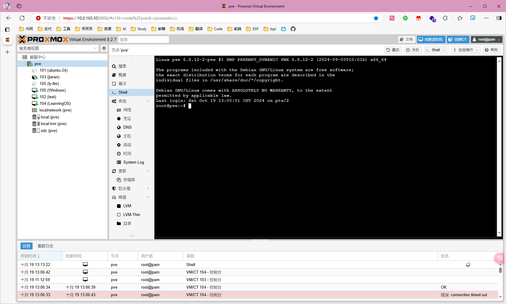
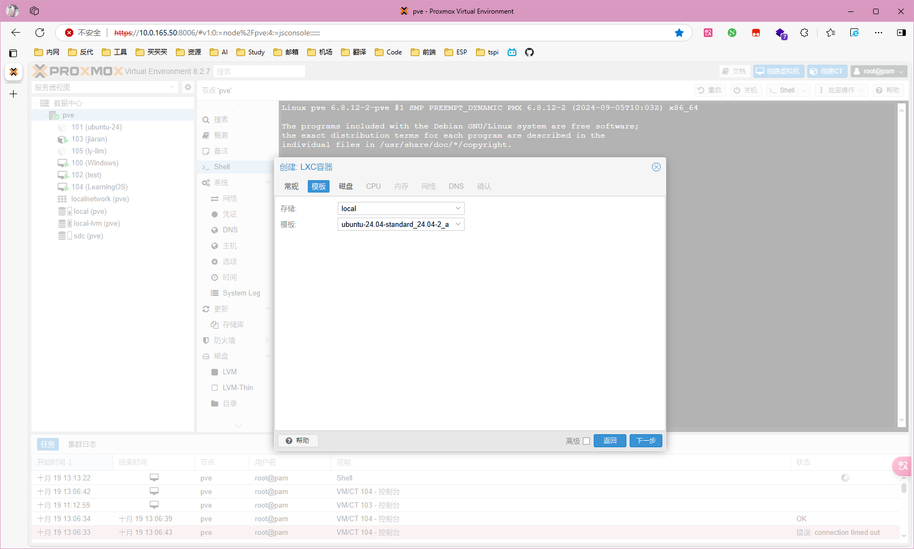
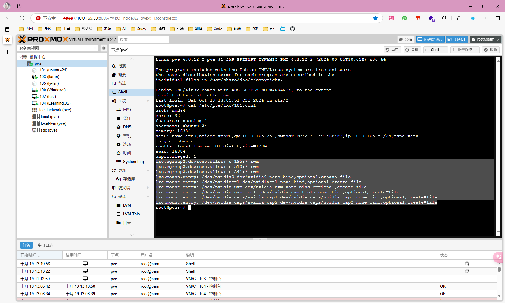
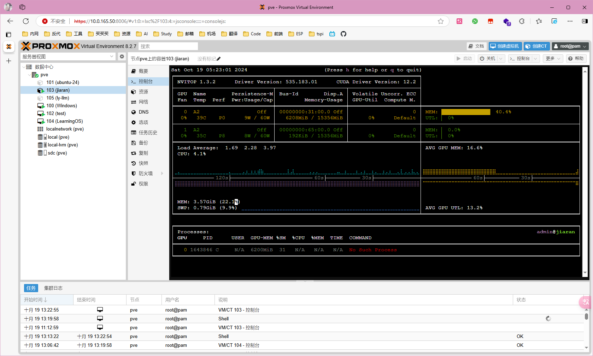

## 技术报告

### 概要
  本项目基于 Rust 语言及其丰富生态, 实现一个简单的读取 I2C 元器件数据手册. 并输出操作代码的大模型应用, 有效减少嵌入式开发难度. 本项目基于 candle 机器学习库实现大模型高性能推理, 使用 pdf_render 库进行pdf解析, 使用 qdrant 向量数据库存储 pdf 数据嵌入.

### 大模型开发环境搭建

  - 安装 Proxmox VE 虚拟化平台
  

  - 宿主机安装显卡驱动
    安装依赖`apt update && apt install build-essential nvidia-modprobe pve-headers-$(uname -r)`
    下载驱动`https://www.nvidia.com/download/index.aspx`
    执行安装`chmod +x NVIDIA-Linux-x86_64-xxx.run && ./NVIDIA-Linux-x86_64-xxx.run`

  - 创建 LXC 容器
    

  - 直通显卡
    在 lxc 配置文件中加入
    ``` shell
    lxc.cgroup2.devices.allow: c 195:* rwm
    lxc.cgroup2.devices.allow: c 510:* rwm
    lxc.cgroup2.devices.allow: c 241:* rwm
    lxc.mount.entry: /dev/nvidia0 dev/nvidia0 none bind,optional,create=file
    lxc.mount.entry: /dev/nvidiactl dev/nvidiactl none bind,optional,create=file
    lxc.mount.entry: /dev/nvidia-uvm dev/nvidia-uvm none bind,optional,create=file
    lxc.mount.entry: /dev/nvidia-uvm-tools dev/nvidia-uvm-tools none bind,optional,create=file
    lxc.mount.entry: /dev/nvidia-caps/nvidia-cap1 dev/nvidia-caps/nvidia-cap1 none bind,optional,create=file
    lxc.mount.entry: /dev/nvidia-caps/nvidia-cap2 dev/nvidia-caps/nvidia-cap2 none bind,optional,create=file
    ```
    

  - 容器内安装显卡驱动
    参考宿主机安装显卡驱动步骤,容器与主机共用内核,注意使用--no-kernel-module
    

### 数据处理
  ``` rust
let pdf = matches.get_one::<String>("pdf").unwrap();

let pdf_records = Pdf::from_file(pdf, false)
    .context("Failed to read PDF file")?
    .spin()
    .context("Failed to process PDF spin")?
    .split(399);
  ```

### 数据存储
  ``` rust
let collection = std::path::Path::new(pdf)
    .file_stem()
    .and_then(|name| name.to_str())
    .ok_or_else(|| anyhow::anyhow!("Failed to extract file stem"))?
    .to_string();

let qdrant = Qdrant::new("http://eromanga.top:6334")?;
match qdrant.delete_collection(&collection).await {
    Ok(_) => println!("Collection deleted successfully"),
    Err(_) => (),
}
qdrant.create_collection(&collection, 384).await?;

let bert = Bert::new().build_model_and_tokenizer().await?;
let embeddings = bert.generate_embeddings(prompts!(&pdf_records)).await?;
qdrant.insert_many(&collection, embeddings.to_vec2()?, pdf_records).await?;
  ```

### 数据查询
  ``` rust
let query_embedding = bert.generate_embedding(prompt!("I2C Timing")).await?;
let result = qdrant.search(&collection, query_embedding.to_vec()?.clone(), 8, None).await?;
let result = result.iter()
.filter_map(|found_point| {
    found_point.payload.as_ref().map(|payload| {
        serde_json::to_string(payload).unwrap_or_else(|_| "{}".to_string())
    })
}).collect::<String>();
  ```

### 模型推理
  ``` rust
pub fn run(&mut self, prompt: &str, sample_len: usize) -> Result<()> {
    use std::io::Write;
    self.tokenizer.clear();
    let mut tokens = self
        .tokenizer
        .tokenizer()
        .encode(prompt, true)
        .map_err(E::msg)?
        .get_ids()
        .to_vec();
    for &t in tokens.iter() {
        if let Some(t) = self.tokenizer.next_token(t)? {
            print!("{t}")
        }
    }
    std::io::stdout().flush()?;

    let mut generated_tokens = 0usize;
    let eos_token = match self.tokenizer.get_token("<|endoftext|>") {
        Some(token) => token,
        None => anyhow::bail!("cannot find the <|endoftext|> token"),
    };
    let start_gen = std::time::Instant::now();
    for index in 0..sample_len {
        let context_size = if index > 0 { 1 } else { tokens.len() };
        let start_pos = tokens.len().saturating_sub(context_size);
        let ctxt = &tokens[start_pos..];
        let input = Tensor::new(ctxt, &self.device)?.unsqueeze(0)?;
        let logits = self.model.forward(&input, start_pos)?;
        let logits = logits.squeeze(0)?.squeeze(0)?.to_dtype(DType::F32)?;
        let logits = if self.repeat_penalty == 1. {
            logits
        } else {
            let start_at = tokens.len().saturating_sub(self.repeat_last_n);
            candle_transformers::utils::apply_repeat_penalty(
                &logits,
                self.repeat_penalty,
                &tokens[start_at..],
            )?
        };

        let next_token = self.logits_processor.sample(&logits)?;
        tokens.push(next_token);
        generated_tokens += 1;
        if next_token == eos_token {
            break;
        }
        if let Some(t) = self.tokenizer.next_token(next_token)? {
            print!("{t}");
            std::io::stdout().flush()?;
        }
    }
    let dt = start_gen.elapsed();
    if let Some(rest) = self.tokenizer.decode_rest().map_err(E::msg)? {
        print!("{rest}");
    }
    std::io::stdout().flush()?;
    println!(
        "\n{generated_tokens} tokens generated ({:.2} token/s)",
        generated_tokens as f64 / dt.as_secs_f64(),
    );
    Ok(())
}
  ```

### Prompt设计
  ``` rust
let prompt_for_model = format!(r#"
你是一位非常专业的嵌入式软件专家. 你会收到一份有关 I2C 元器件的 Datasheet 中提取的相关摘录.
然后, 你会尽最大努力如实以 micropython 代码
的形式告诉我如何对这个元件进行 初始化 以及 读取数据.
这是 Datasheet 的相关摘要: {}
现在, 请你开始输出代码
"#, result);
  ```